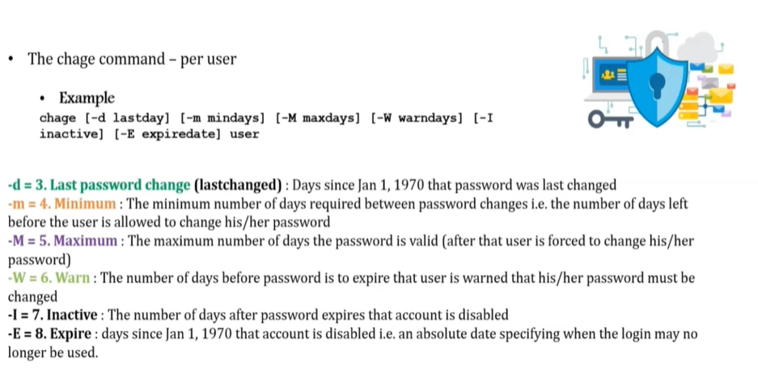

# **User Account Management**

---

- useradd
- groupadd
- userdel
- groupdel
- usermod

Files

```sh
- /etc/passwd
- /etc/group
- /etc/shadow
```

Example 

```sh
useradd -g superheros -s /bin/bash -c "user description" -m -d /home/spiderman spiderman
# -g : group
# -s : give shell env
# -c : user decription
# -m and -d : user home dir and user itself
```

```sh
useradd spiderman               # create a user spiderman
id spiderman                    # verify if the user created
groupadd superheros             # create a group superheros
cat /etc/group                  # verify if the group created
userdel -r spiderman            # delete the user and its dir
groupdel superheros             # delete the superheros group
usermod -G superheros spiderman # Add spiderman to superheros group as well
grep spiderman /etc/group       # We can see spiderman belongs to his own group (spiderman) also to superheros.
ls -ltr                         # group of spiderman still showing spiderman. How to change it?
chgrp -R superheros spiderman   # change group of spiderman to superheros 
cat /etc/passwd                 # name:password:uid:gid:desc:homeDir:shell
cat /etc/group                  # name:password:gid
cat /etc/shadow                 # 
```

```sh
useradd -g superheros -s /bin/bash -c "user description" -m -d /home/spiderman spiderman
```

- To set Password

```sh
passwd supermam
```

---

# **Enable Password Aging**

---

- `/etc/login.defs`

```sh
PASS_MAX_DAYS   99999
PASS_MIN_DAYS   0
PASS_MIN_LEN    5
PASS_MAX_LEN    7
```

---

# **The chage Command**

---



```sh
grep babubutt /etc/shadow       
chage -m 5 -M 90 -W 10 -I 3 babubutt
grep babubutt /etc/shadow
```

---

# **Switch Users and sudo Access**

---

```sh
su - username
sudo command
visudo
```

- File : `/etc/sudoers`

---


