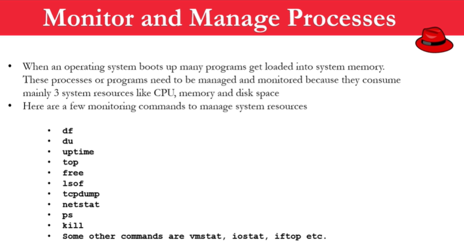

# **Process & Jobs**

---

- Applicatin = Service
- Script
- Process
- Daemon
- Threads
- Jobs

---

# **Monitor & Manage Processes**

---



```sh
df -h                           # File Systems [disk space, etc]  -h: human readable[GB] | /dev is on focus
du                              # All the individual file systems
du -k /                         # All the individual file systems in KB
du -k / | sort -nr | more       # All the individual file systems in KB | sorting in rev order
du -h / | sort -nr | more       # All the individual file systems in human readable[GB] | sorting in rev order
df -T                           # What type of file system we have
```

```sh
uptime           # total uptime (running time)
```

```sh
top                 
```

```sh
top - 22:59:08 up 14 min,  0 users,  load average: 0.52, 0.58, 0.59
Tasks:   4 total,   1 running,   3 sleeping,   0 stopped,   0 zombie
%Cpu(s):  1.6 us,  0.3 sy,  0.0 ni, 98.1 id,  0.0 wa,  0.0 hi,  0.0 si,  0.0 st
MiB Mem :  11703.2 total,   5326.3 free,   6152.9 used,    224.0 buff/cache
MiB Swap:  27796.9 total,  27732.9 free,     64.0 used.   5419.7 avail Mem

  PID USER      PR  NI    VIRT    RES    SHR S  %CPU  %MEM     TIME+ COMMAND
    1 root      20   0    8940    320    276 S   0.0   0.0   0:00.07 init
  128 root      20   0    8940    228    184 S   0.0   0.0   0:00.00 init
  129 imrul     20   0   18096   3628   3536 S   0.0   0.0   0:01.00 bash
  200 imrul     20   0   18904   2140   1524 R   0.0   0.0   0:00.05 top
```

---


