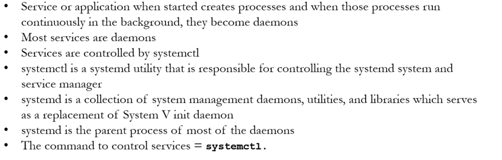

# **Control Services & Daemons**

---



---

**Check if systemd installed in your system**

```sh
systemctl --version
```
`Output`

```sh
systemd 219
+PAM +AUDIT +SELINUX +IMA -APPARMOR +SMACK +SYSVINIT +UTMP +LIBCRYPTSETUP +GCRYPT +GNUTLS +ACL +XZ +LZ4 -SECCOMP +BLKID +ELFUTILS +KMOD +IDN
```

**Check if systemd is running**

```sh
ps -ef | grep system
```

**Check alll running services**

```sh
systemctl --all     # All the running packages and applications
```

```sh
rpm -qa             # List all the packages and applications
rpm -qa | wc -l     # Total number of packages and applications
```

**To check the status, start, stop and restart a service**

```sh
ps -ef | grep applicatin                    # Check status
systemctl status application.services       # Check status
systemctl start application.services        # Start the service
systemctl stop application.services         # Stop the servide
systemctl restart application.services      # Restart the service
```

```sh
kill 37443                                  # Kill the service when problem
```

**To reload the configuration of a service**

```sh
systemctl reload application.services       # without stop/start
```

**To enable or disable a service at boot time**

```sh
systemctl enable application.services      # Enable service at startup
systemctl disable application.services
```

> `Caution:` Never disable boot services. Because of it booting will not run after stop the PC

**To enable or disable a service completely (at boot time)**

```sh
systemctl mask application.services
systemctl unmask application.services
```

---


