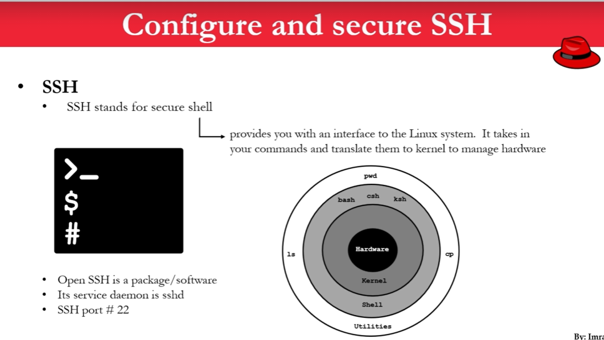
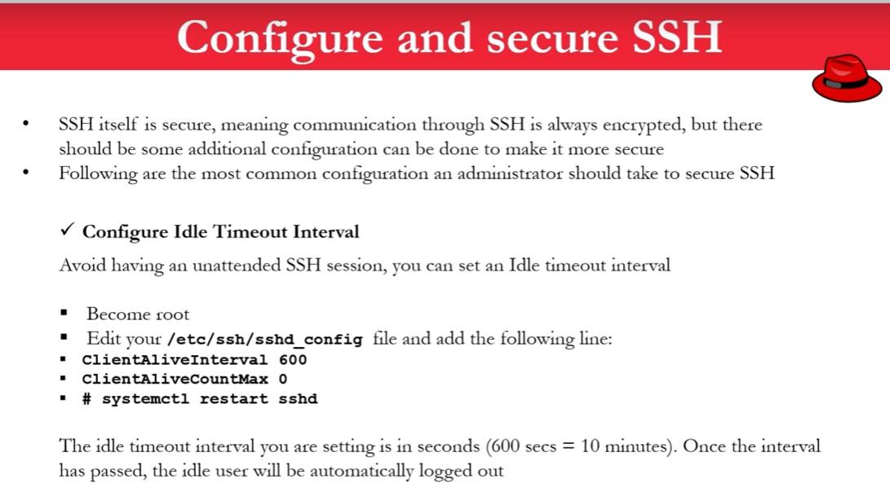
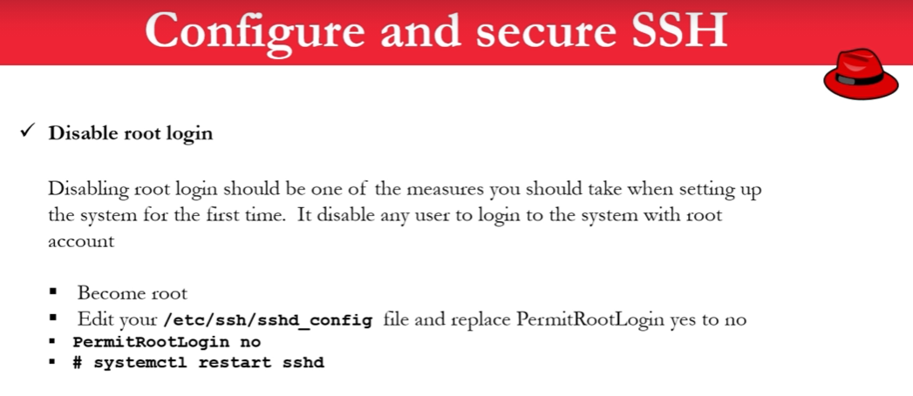
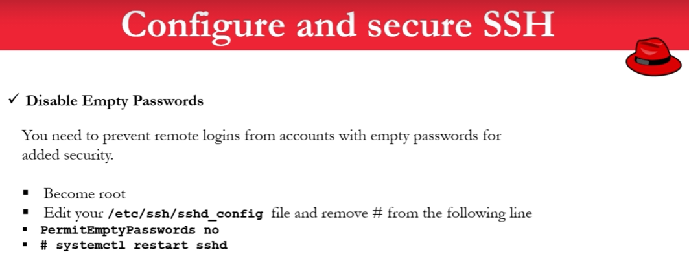
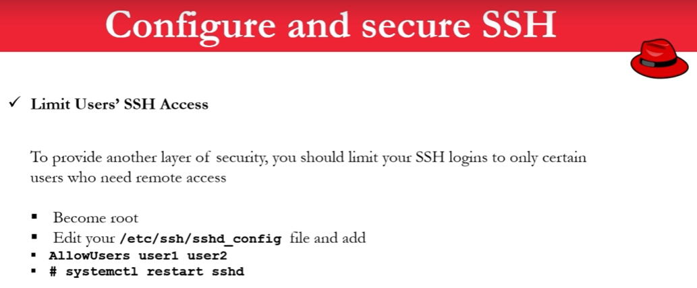
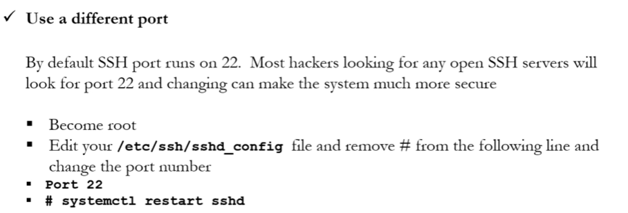
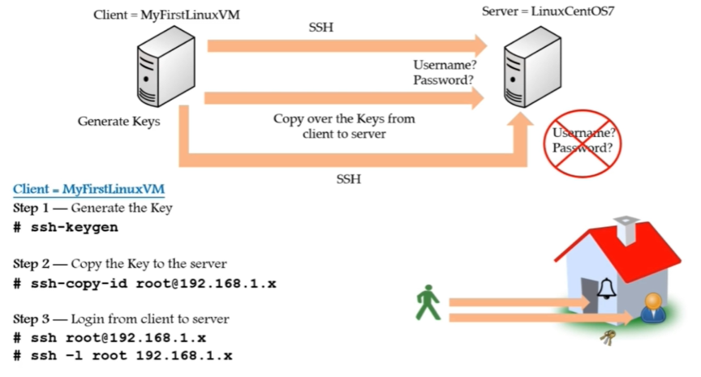
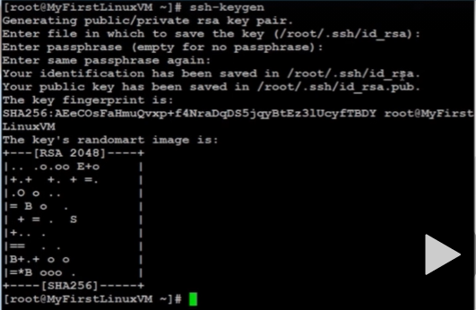

# **Configure & Secure SSH**

---



### Security 1: Login Timeout Setting




```sh
cp /etc/ssh/sshd_config /etc/ssh/sshd_config-bkp    # backup
vi /etc/ssh/sshd_config
```

Add following lines at the end of the file

```conf
# Setting Timeout Interval
ClientAliveInterval 600
CleintAliveCountMax 0
```

Now restart the service.

```sh
systemctl restart sshd
```

---

### Security 2: Disable root login



```sh
cp /etc/ssh/sshd_config /etc/ssh/sshd_config-bkp    # backup
vi /etc/ssh/sshd_config
```

Edit the file

```conf
PermitRootLogin no  
```

Now restart the service.

```sh
systemctl restart sshd
```

---


### Security 3: Disable empty password



```sh
cp /etc/ssh/sshd_config /etc/ssh/sshd_config-bkp    # backup
vi /etc/ssh/sshd_config
```

Uncomment the following line 

```sh
PermitEmptyPasswords no
```

Now restart the service.

```sh
systemctl restart sshd
```

---

### Security 4: Limit Users SSH access



```sh
cp /etc/ssh/sshd_config /etc/ssh/sshd_config-bkp    # backup
vi /etc/ssh/sshd_config
```

```sh
# Allow the following users only
AllowUsers imrul anower samir
```

Now restart the service.

```sh
systemctl restart sshd
```

---

### Security 5: Use a different port




```sh
cp /etc/ssh/sshd_config /etc/ssh/sshd_config-bkp    # backup
vi /etc/ssh/sshd_config
```

Change the port number (Uncomment it first)

```conf
Port 22 # default value is 22. We can change it 
```

> We can find available port number on internet which is used for `SSH`

Now restart the service.

```sh
systemctl restart sshd
```

---

# **SSH - Keys | Access Remote Server without Password**

---




**Step 1: Generate Key from Client OS**

```sh
ssh-keygen
```



> id has been saved in `/root/.ssh/id_rsa.pub`


**Step 2: Copy the ID to the Server(Remote)**

```sh
ssh-copy-id root@192.168.1.58
```

**Step 3: Check the Server(Remote) if everything is okey**

```sh
cd /root/.ssh/
ls
```

```sh
cat authorized_keys
```

**Step 4: Login from the client to server**

```sh
ssh root@192.168.1.58       # IP of Server: 192.168.1.58
ssh -l root 192.168.1.58
```

---


