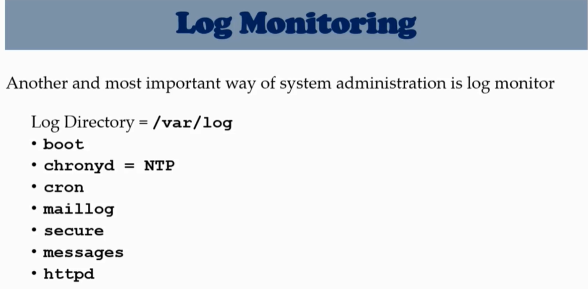

# **Log Monitoring**

---




Log Directory

```sh
cd /var/log
ls -l   # list 
ll      # list (way 2)
```


[Linux Log Files 1](https://www.eurovps.com/blog/important-linux-log-files-you-must-be-monitoring/)
[Linux Log Files 2](https://linuxtechlab.com/important-logs-monitor-identify-issues/)

---


