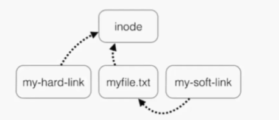

# **File Maintenace Commands**

---

- cp
- rm
- mv
- mkdir
- rmdir or rm- r
- chgrp
- chown

---

### cp

```sh
cp data data1   # cp data as data1
cp data /temp   # cp data to temp dir as data
```

### rm

```sh
rm data # remove data from current dir
```

### mv

```sh
mv data data1   # rename data to data1 in same dir
mv puddy /tmp   # move puddy to /tmp dir
```

### mkdir

```sh
mkdir data  # make a dir with name data
```

### rmdir or rm -r

```sh
rmdir data  # remove dir data
rm -r data  # remove dir    ::  rm -rf = forcefully remove sub-dirs and its contents :: Recursively
```

### chgrp

```sh
chgrp root file    # ownership of file group to root
```

- root access needed

### chown

```sh
chown root file1    # ownership to root of file1
chown imrul:imrul file1 # ownership and group to imrul of file1
```

---

# **Soft and Hard Links**

---

- `inode` : pointer or number of a file on the hard disk
    - Computer doesn't recognize the file name.
    - Computer knows a file with `inode`.

- `soft link` : Linked will be removed if file is removed or renamed.

- `hard link` : Deleting , renaming or moving the original file will not affect the hard link.

### Hard and Soft Link

```sh
ln      # Hard Link
ln -s   # Soft Link
```



---

### Soft Link

```sh
ls -ltri  # to see inode of files
# 40813871623084217 -rw-r--r-- 1 imrul imrul 12 Aug 20 14:37 hulk
```

```sh
/home/imrul $ touch hulk
/home/imrul $ ls -ltri      # inode : 40813871623084217
/home/imrul $ cd /tmp
/tmp $
/tmp $ ln -s /home/imrul/hulk   # Soft Link Created
/tmp $ ls -ltri             # inode : 52635820644932163
# so hulk in imrul and linked hulk in tmp has different inode.
```

### Hard Link

```sh
/home/imrul $ touch hulk
/home/imrul $ ls -ltri      # inode : 156500087051133528
/home/imrul $ cd /tmp
/tmp $
/tmp $ ln /home/imrul/hulk   # Hard Link Created
/tmp $ ls -ltri             # inode : 156500087051133528
# so hulk in imrul and linked hulk in tmp has same inode.
```

---

# **Input and Output Redirects**

---

### 3 Types of Redirects

1. `stdin` [file descriptior number: 0]
2. `stdout` [file descriptior number: 1]
3. `stderr` [file descriptior number: 2]

---

### **stdout**

- by default running command outputs goes to terminal
- Output of a file can be routed to file using `>` symbol
- Output of a file can be appended to file using `>>` symbol


```sh
/home $ ls -l > file.txt                # Edit file.txt with text of list of the dir [overwrite]
/home $ echo "hello world" > file.txt   # Edit file.txt with text of list of the dir [overwrite]
/home $ ls -l >> file.txt               # Append text in the file.txt                [Append]
/home $ echo "hello world" >> file.txt  # Append text in the file.txt                [Append]
/home $ cat > file.txt
```

### **stdin**

- feeding file contents to a file

```sh
echo "write something..." > letter
mail -s "From Imrul" imrulhasan273@gmail.com < letter
```

```sh
ls -l /root                     # error
ls -l /root 2>errorfile         # Error msg is sent to file | 2 => output
telnet localhost 2>errorfile    # Outputs non Error msg and Error msg to errorfile
```

---

---

# **Pipes**

---

- A Pipe is used by the shell to connect the output of one command directly to the input of another command.

- **command1 [args] | command2 [args]**

```sh
cd /etc         # A lot of files out there
ls -l | more    # Piped ---> keep Spacing bar to view more....
```

---

# **Help Commands**

---

### types of Help Commands

1. whatis command
2. command --help   
3. man command        


```sh
whatis ls
ls --help
man ls
```

---

